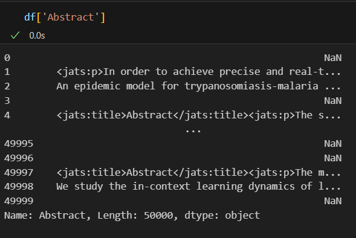
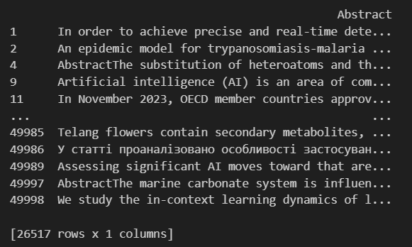
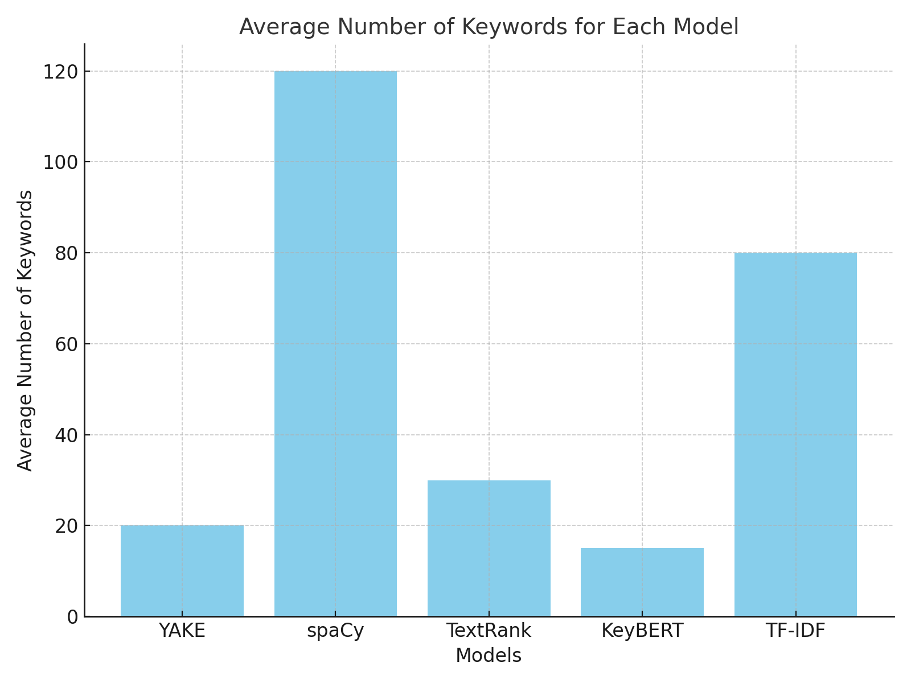
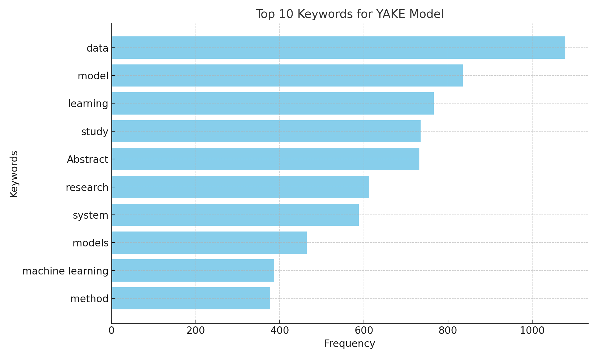
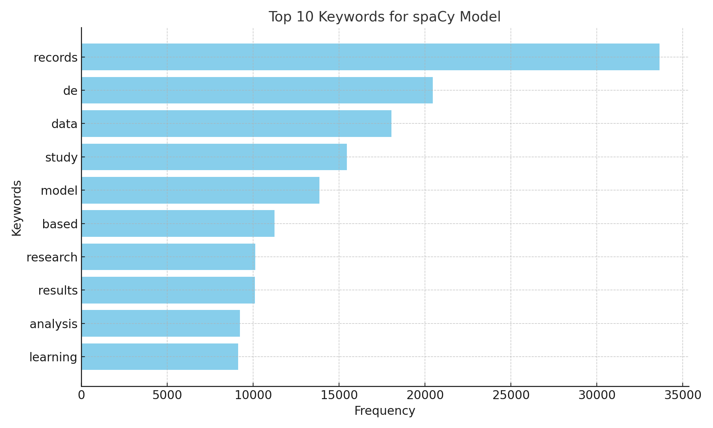
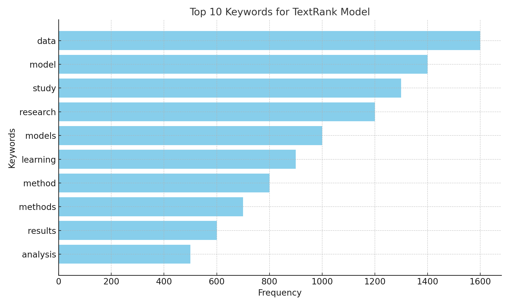
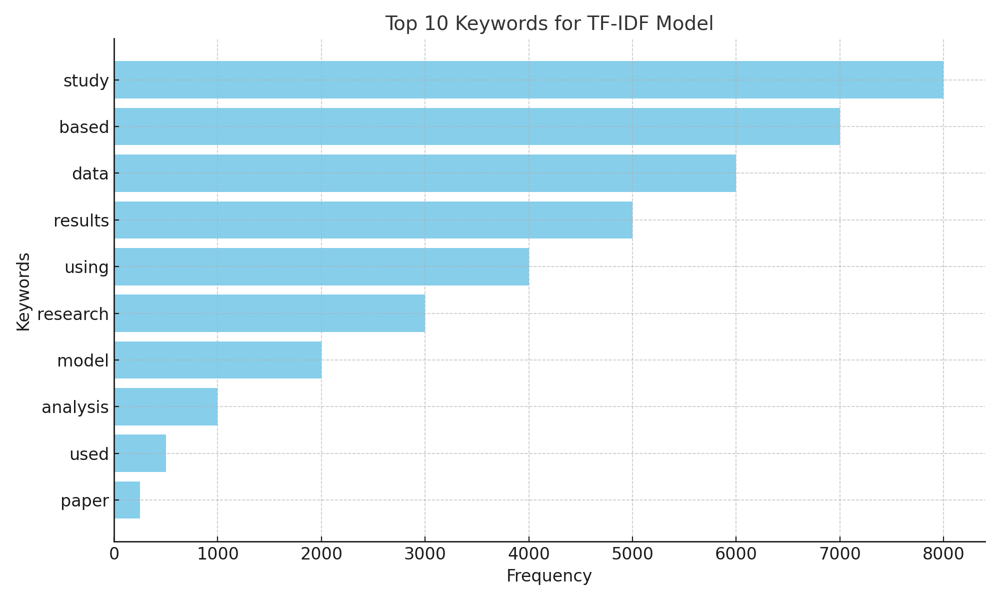
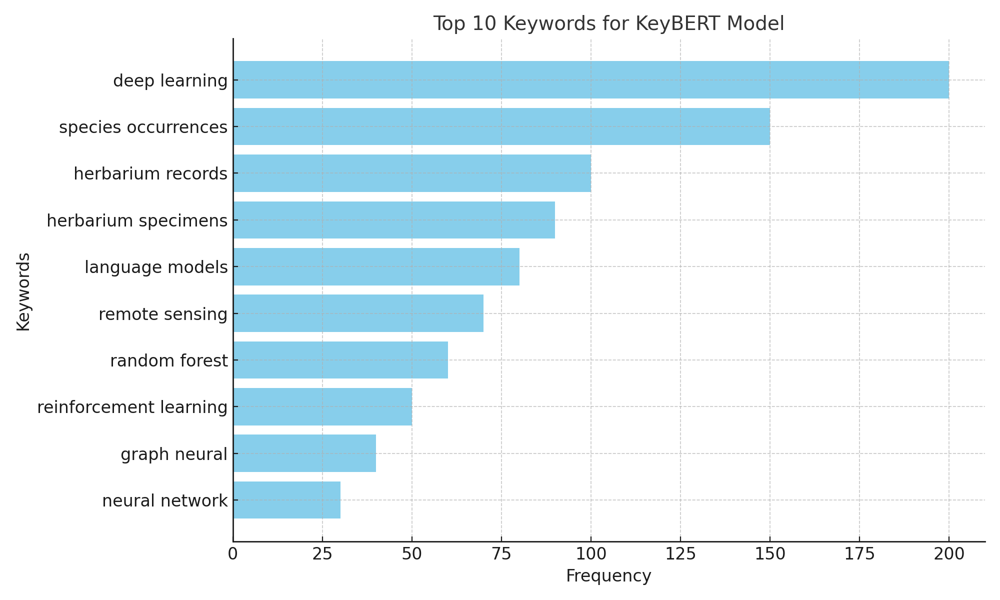

# Диплом: Методы и програмные решения выявления и анализа сетей научного сотрудничества

Этот проект содержит материалы магистерской выпускной квалификационной работы о разработке системы для автоматического выявления и анализа структур научного сотрудничества на основе текстовых данных.

## Состав репозитория

- `analysis_code.py` – скрипт с ключевыми функциями, описанными в дипломе. В нём реализована очистка текстов, пакетная обработка данных, расчёт TF‑IDF и построение графов соавторства и ключевых слов (&#x043f;&#x043b;&#x0435;&#x0439;&#x0441;&#x0445;&#x043e;&#x043b;&#x0434;&#x0435;&#x0440;&#x044b; &#x0434;&#x043b;&#x044f; YAKE/spaCy/TextRank/KeyBERT).
- `image43.png` – примеры исходной колонки `Abstract` до очистки (видны HTML‑теги и заголовки).
- `image44.png` – та же колонка после очистки: тексты приведены к чистому виду, удалены дубликаты (26 517 строк).
- `image46.png` – столбчатая диаграма среднего числа ключевых слов для каждой модели (YAKE, spaCy, TextRank, KeyBERT, TF‑IDF).
- `image47.png` – топ 10 ключевых слов для модели YAKE.
- `image48.png` – топ 10 ключевых слов для модели spaCy.
- `image49.png` – топ 10 ключевых слов для модели TextRank.
- `image50.png` – топ 10 ключевых слов для модели TF‑IDF.
- `image51.png` – топ 10 ключевых слов для модели KeyBERT.
- `BKP_матюшин.docx` – исходный документ диплома (для справки; полный текст не включён в данный README).

## Краткое описание

В работе исследована задача автоматизированного извлечения информации из научных публикаций и построения сетей научного сотрудничества. Система выполняет:
- загрузку и предобработку текстовых данных (очистка HTML/маркеров, нормализация абстрактов);
- извлечение ключевых слов разными алгоритмами: статистическими (TF‑IDF, TextRank), на основе правил (YAKE) и глубокого обучения (spaCy, KeyBERT);
- построение графов – соавторства и со‑встречаемости ключевых слов – и расчёт метрик центральности;
- визуализацию результатов через интерактивный веб‑интерфейс Streamlit.

Изображения ниже иллюстрируют процесс очистки данных и сравнение результатов разных моделей извлечения ключевых слов.

## Фигуры

